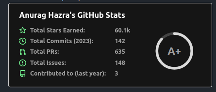

<picture>
 <source media="(prefers-color-scheme: dark)" srcset="images/banner_dark.png">
 <source media="(prefers-color-scheme: light)" srcset="images/banner_light.png">
 
</picture>

  <h2>Hello there! </h2>

My name is Timofey Grigorenko. I'm involved in backend development with Python and also use Machine Learning to some extent.

### 🤝 Connect with me:

  <a href="https://t.me/yo_tima/">
      - @yo_tima
  </a>

  <a href="mailto:yotgrig@yandex.ru">
    
    - yo.tgrig@yandex.ru
  </a>

## 🔧 Technologies & Tools

  [![Python][Python]][Python-url]
  [![FastAPI][FastAPI]][FastAPI-url]
  [![Django][Django]][Django-url]
  [![DRF][DRF]][DRF-url]
  [![SQL][SQL]][SQL-url]
  
  [![HTML][HTML]][HTML-url]
  [![CSS][CSS]][CSS-url]
  [![Bootstrap][Bootstrap]][Bootstrap-url]
  [![Docker][Docker]][Docker-url]
  [![Linux][Linux]][Linux-url]
  
  [![Sklearn][Sklearn]][Sklearn-url]
  [![Numpy][Numpy]][Numpy-url]
  [![Pandas][Pandas]][Pandas-url]

## 📈 GitHub Stats

[Python-url]: https://python.org
[Python]: https://img.shields.io/badge/Python-3570a0?style=for-the-badge&logo=python&logoColor=ffe366
[Django-url]: https://www.djangoproject.com/
[Django]: https://img.shields.io/badge/Django-0c4b33?style=for-the-badge&logo=django&logoColor=44b78b
[FastAPI-url]: https://fastapi.tiangolo.com/
[FastAPI]: https://img.shields.io/badge/FastAPI-009485?style=for-the-badge&logo=fastapi&logoColor=ffffff
[DRF-url]: https://www.django-rest-framework.org/
[DRF]: https://img.shields.io/badge/Django_Rest_Framework-562d2d?style=for-the-badge&logo=django&logoColor=a30000
[SQL-url]: https://www.postgresql.org/
[SQL]: https://img.shields.io/badge/SQL-32658f?style=for-the-badge&logo=postgresql&logoColor=ffffff

[HTML-url]: https://html.com/html5/
[HTML]: https://img.shields.io/badge/HTML-e24921?style=for-the-badge&logo=html5&logoColor=ffffff
[CSS-url]: https://html.com/css/
[CSS]: https://img.shields.io/badge/CSS-026eb9?style=for-the-badge&logo=css3&logoColor=ffffff
[Bootstrap-url]: https://getbootstrap.com/
[Bootstrap]: https://img.shields.io/badge/Bootstrap-7110f5?style=for-the-badge&logo=bootstrap&logoColor=ffffff
[Docker-url]: https://www.docker.com/
[Docker]: https://img.shields.io/badge/Docker-003f8c?style=for-the-badge&logo=docker&logoColor=ffffff
[Linux-url]: https://www.linux.org/
[Linux]: https://img.shields.io/badge/Linux-185886?style=for-the-badge&logo=linux&logoColor=ffffff

[Sklearn-url]: https://scikit-learn.org/stable/
[Sklearn]: https://img.shields.io/badge/Sklearn-3499cd?style=for-the-badge&logo=scikit-learn&logoColor=f89939
[Pandas-url]: https://pandas.pydata.org/
[Pandas]: https://img.shields.io/badge/Pandas-130654?style=for-the-badge&logo=pandas&logoColor=e70488
[Numpy-url]: https://numpy.org/
[Numpy]: https://img.shields.io/badge/Numpy-013243?style=for-the-badge&logo=numpy&logoColor=4dabcf